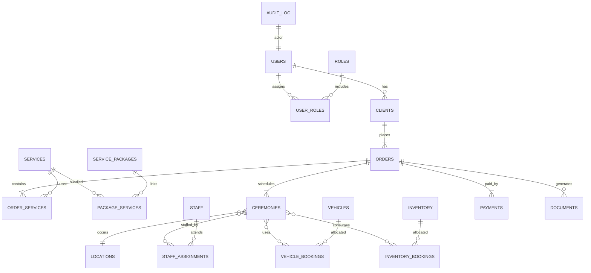

# Проектирование базы данных

## ER-диаграмма (описательно)

## Таблицы и ключевые поля

### 1. `roles`
- `id` (PK)
- `code` (UNIQUE)
- `name_ru`, `name_en`
- `description`

### 2. `users`
- `id` (PK)
- `email` (UNIQUE)
- `password_hash`
- `first_name`, `last_name`
- `phone`
- `status` (enum: active, pending, blocked)
- `created_at`, `updated_at`

### 3. `user_profiles`
- `user_id` (PK, FK → users)
- `preferred_language`
- `theme`
- `date_format`
- `number_format`
- `page_size`
- `saved_filters` (JSON)

### 4. `user_roles`
- `user_id` (FK → users)
- `role_id` (FK → roles)
- PK (`user_id`, `role_id`)

### 5. `clients`
- `id` (PK)
- `user_id` (FK → users, NULL для гостей)
- `full_name`
- `contact_email`
- `contact_phone`
- `address_encrypted` (VARBINARY)
- `passport_encrypted`
- `notes`

### 6. `deceased`
- `id` (PK)
- `client_id` (FK → clients)
- `full_name`
- `birth_date`
- `death_date`
- `cause_of_death`
- `burial_type` (enum: burial, cremation, other)
- `religion`
- `bio`

### 7. `services`
- `id` (PK)
- `code` (UNIQUE)
- `name_ru`, `name_en`
- `description_ru`, `description_en`
- `base_price`
- `currency`
- `category`
- `is_active`

### 8. `service_packages`
- `id` (PK)
- `code` (UNIQUE)
- `name_ru`, `name_en`
- `description_ru`, `description_en`
- `base_price`
- `currency`
- `is_active`

### 9. `package_services`
- `package_id` (FK → service_packages)
- `service_id` (FK → services)
- `quantity`
- PK (`package_id`, `service_id`)

### 10. `orders`
- `id` (PK)
- `client_id` (FK → clients)
- `responsible_user_id` (FK → users)
- `deceased_id` (FK → deceased)
- `package_id` (FK → service_packages, NULL если индивидуально)
- `status` (enum: draft, pending, confirmed, in_progress, completed, cancelled)
- `total_amount`
- `currency`
- `contract_number`
- `created_at`, `updated_at`
- `deleted_at`

### 11. `order_services`
- `order_id` (FK → orders)
- `service_id` (FK → services)
- `quantity`
- `unit_price`
- `discount`
- `notes`
- PK (`order_id`, `service_id`)

### 12. `locations`
- `id` (PK)
- `type` (enum: funeral_home, cemetery, crematorium, chapel, restaurant)
- `name`
- `address`
- `contact_phone`
- `capacity`
- `is_partner`

### 13. `ceremonies`
- `id` (PK)
- `order_id` (FK → orders)
- `location_id` (FK → locations)
- `start_at`
- `end_at`
- `status`
- `notes`

### 14. `staff`
- `id` (PK)
- `user_id` (FK → users, nullable для подрядчиков)
- `full_name`
- `role`
- `phone`
- `email`
- `external_company`
- `is_active`

### 15. `staff_assignments`
- `ceremony_id` (FK → ceremonies)
- `staff_id` (FK → staff)
- `role`
- `notes`
- PK (`ceremony_id`, `staff_id`)

### 16. `vehicles`
- `id` (PK)
- `plate_number` (UNIQUE)
- `type`
- `capacity`
- `is_active`

### 17. `vehicle_bookings`
- `ceremony_id` (FK → ceremonies)
- `vehicle_id` (FK → vehicles)
- `driver_id` (FK → staff)
- `start_at`
- `end_at`
- PK (`ceremony_id`, `vehicle_id`)

### 18. `inventory`
- `id` (PK)
- `name`
- `sku`
- `category`
- `quantity_total`
- `quantity_available`

### 19. `inventory_bookings`
- `ceremony_id` (FK → ceremonies)
- `inventory_id` (FK → inventory)
- `quantity`
- `notes`
- PK (`ceremony_id`, `inventory_id`)

### 20. `payments`
- `id` (PK)
- `order_id` (FK → orders)
- `amount`
- `currency`
- `method`
- `status`
- `transaction_ref`
- `paid_at`
- `receipt_url`

### 21. `documents`
- `id` (PK)
- `order_id` (FK → orders)
- `type`
- `title`
- `file_path`
- `generated_at`
- `sign_status`

### 22. `audit_log`
- `id` (PK)
- `user_id` (FK → users)
- `action`
- `entity`
- `entity_id`
- `before_data` (JSON)
- `after_data` (JSON)
- `ip_address`
- `user_agent`
- `created_at`

### 23. `backup_jobs`
- `id` (PK)
- `job_name`
- `backup_type`
- `target_path`
- `last_run_at`
- `status`
- `comments`

## Нормализация и типовые ограничения
- Все справочники вынесены в отдельные таблицы с уникальными кодами.
- M:N связи реализованы через стыковочные таблицы (`user_roles`, `package_services`, `order_services`, `staff_assignments`, `vehicle_bookings`, `inventory_bookings`).
- Обязательные поля помечаются `NOT NULL`; бизнес-правила проверяются `CHECK` (например, `start_at < end_at`).
- Для денег — тип `DECIMAL(18,2)`; валюты — ISO-коды (FK на таблицу `currencies`, при необходимости).
- Логическое удаление через `deleted_at` + триггеры, чтобы не терять аудит.

## Представления
1. `vw_active_orders` — свод по текущим заказам с клиентами, суммами, статусами.
2. `vw_ceremony_schedule` — расписание церемоний с местами, персоналом, транспортом.
3. `vw_financial_summary` — платежи по периодам/категориям, для аналитики.
4. `vw_inventory_load` — доступность инвентаря в разрезе дат.

## Хранимые процедуры (план)
1. `sp_create_order` — создание заказа с пакетными услугами, валидация и расчёт итоговой суммы (транзакция).
2. `sp_assign_ceremony_resources` — назначение ресурса на церемонию с проверкой конфликтов расписания.
3. `sp_register_payment` — фиксация платежа, обновление статуса заказа, журналирование.
4. `sp_generate_backup` — создание резервной копии SQL Server с записью результата в `backup_jobs`.

## Триггеры
- `trg_orders_audit` — логирование изменений заказов.
- `trg_clients_encrypt` — автоматическое шифрование/маскирование критичных полей.
- `trg_payments_validate` — проверка допустимых статусов и суммы.

## Индексы
- Уникальные индексы: `users.email`, `roles.code`, `services.code`, `vehicles.plate_number`.
- Составные индексы для выборок: `orders(client_id, status)`, `ceremonies(start_at, location_id)`, `payments(order_id, paid_at)`.

Примечание: точные типы и ограничения будут заданы в SQL-скриптах в каталоге `db/`.
